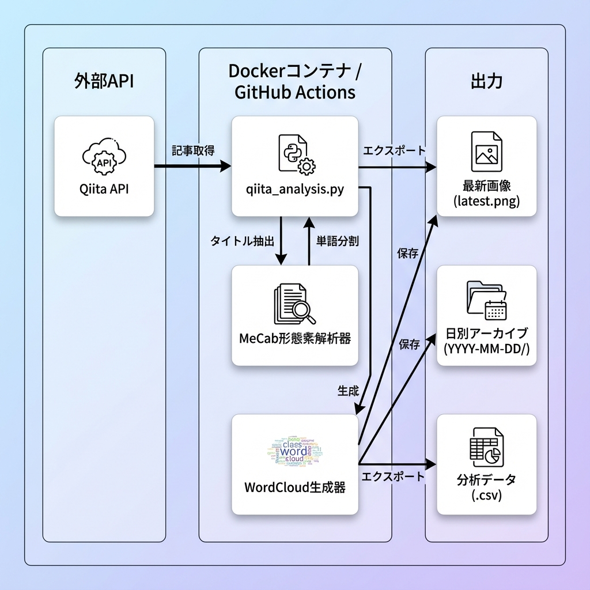

*最終更新: 2025-11-30*

# Qiita Title Analyzer


## 📖 概要

**Qiita Title Analyzer** は、Qiita上のトレンド記事を分析し、今どのような技術やトピックが注目されているかを可視化するツールです。
Qiita APIを利用して「いいね数」が多い記事を収集し、そのタイトルを自然言語処理（MeCab）で解析。頻出単語をWordCloudとして生成します。
このプロセスはGitHub Actionsによって毎日自動実行され、常に最新のトレンドをキャッチアップできます。

## ✨ 主な機能

-   **トレンド抽出**: Qiita APIから記事を取得し、いいね数上位10%の「バズ記事」のみを厳選して分析対象とします。
-   **高度な形態素解析**: MeCabを使用し、日本語のタイトルを正確に分かち書き・品詞分解します。
-   **自動化されたワークフロー**: GitHub Actionsにより毎日自動で分析が走り、結果画像がリポジトリにコミットされます。
-   **Docker完全対応**: 環境構築の手間なく、コマンド一つでローカルでも同様の分析を実行可能です。

## 🏗 アーキテクチャ



## 🛠 技術スタック

| Category | Technology | Purpose |
| :--- | :--- | :--- |
| **Language** | Python 3.9+ | メインロジックの実装 |
| **Container** | Docker | 実行環境の統一とポータビリティ |
| **CI/CD** | GitHub Actions | 定期実行と自動デプロイ |
| **NLP** | MeCab | 日本語形態素解析 |
| **Analysis** | Pandas | データ操作と集計 |
| **Visualization** | WordCloud, Matplotlib | データの可視化 |

## 🚀 はじめに

ローカル環境で分析を実行する手順です。

### 前提条件

-   Docker
-   Docker Compose

### インストールと実行

リポジトリをクローンし、Docker Composeで起動するだけで分析が始まります。

```bash
# リポジトリのクローン
git clone https://github.com/Ryo-9591/Qiita_Title_Analyzer.git
cd Qiita_Title_Analyzer

# アプリケーションのビルドと実行
docker-compose up --build
```

実行が完了すると、`docs/images/` ディレクトリに結果が出力されます。

### 設定（オプション）

Qiita APIのレート制限（1時間あたり60回）を緩和（1時間あたり1000回）したい場合は、アクセストークンを設定してください。

1.  [Qiitaの設定ページ](https://qiita.com/settings/applications)で個人用アクセストークンを発行します。
2.  環境変数 `QIITA_TOKEN` を設定して実行します。

```bash
docker run -v $(pwd)/docs/images:/app/docs/images -e QIITA_TOKEN=your_token_here qiita-analyzer
```

## 📂 ディレクトリ構成

```text
.
├── .github/workflows/    # GitHub Actionsワークフロー定義
├── docs/images/          # 生成された画像とアーティファクト
│   ├── latest.png        # 最新のWordCloud画像
│   └── YYYY-MM-DD/       # 日付別アーカイブ結果
├── qiita_analysis.py     # メイン分析スクリプト
├── Dockerfile            # Dockerイメージ定義
├── docker-compose.yml    # Docker Compose設定
├── requirements.txt      # Python依存関係
└── README.md             # プロジェクトドキュメント
```

## 🤖 自動化

本プロジェクトは **GitHub Actions** を利用して完全自動化されています。

-   **スケジュール**: 毎日 UTC 00:00 (JST 09:00)
-   **処理内容**:
    1.  最新記事の取得と分析
    2.  WordCloud画像の生成
    3.  `docs/images/` への保存
    4.  READMEの更新（最新画像の反映）
    5.  変更のコミットとプッシュ

手動で実行したい場合は、GitHubのリポジトリ画面から `Actions` タブを開き、`Generate Qiita WordCloud Daily` ワークフローを選択して `Run workflow` をクリックしてください。

## 📄 ライセンス

このプロジェクトはMITライセンスの下で公開されています。詳細は[LICENSE](LICENSE)ファイルをご覧ください。
